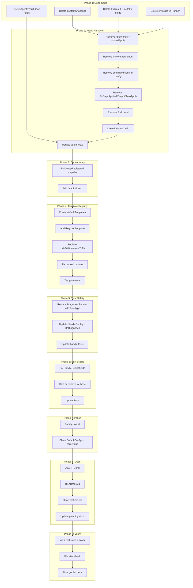

# Execution Plan — go-error-family Architectural Cleanup

**Date:** 2026-05-16 22:32
**Branch:** master
**Status:** Clean working tree, 130/130 tests pass
**Goal:** Make this library honest, type-safe, and properly composed before v0.1.0

---

## Pareto Analysis

### The 1% that delivers 51% of the result

1. **Delete dead code** (SystemSnapshot) + **fix deadlock risk** (lookupRegistered snapshot) — removes 2 of the 5 stupidest things in 15 minutes. Immediate honesty gain.

### The 4% that delivers 64% of the result

2. **Remove ApplyFixes fraud** — strips the agent of its lying execution layer. The agent becomes an honest advisor (propose, don't execute). This single change removes `AllowedCommands`, `ForbiddenCommands`, `ConfirmFunc`, `MaxRetries`, `shouldApply`, `ApplyFixes` — ~80 lines of fraudulent code.
3. **Replace codeToWhat/codeToFix with explicit template registry** — kills the magic substring matching. Every error code gets an exact template or a family fallback. Predictable, testable, honest.

### The 20% that delivers 80% of the result

4. **Fix HandleResult split brain** — `ErrorReported bool` + `Diagnostics []string` are never populated by `HandleErrorDetailed`. Remove or wire.
5. **Fix DiagnosticRunner `any` return** — replace interface with `func` type that returns `[]*DiagnosticResult` via a local result type, or better: move HandleError to a `cli` package. For now: use a function type to avoid the circular import without type erasure.
6. **Clean up agent Config** — remove `Model`, `MaxTokens`, `SystemPrompt`, `TokensUsed` (all AI-provider concerns that don't belong in the protocol library). The agent package should only define the analysis interface and deterministic fallback.
7. **Fix unused parameters** in `formatWhy` and `applyTemplate` — use the params or remove them.

---

## Comprehensive Issue List

### Type Safety & Impossible States

| #   | Issue                                                                             | File                             | Fix                                                                                                               |
| --- | --------------------------------------------------------------------------------- | -------------------------------- | ----------------------------------------------------------------------------------------------------------------- |
| 1   | `Family` is `int` — any int is a valid Family                                     | `family.go:11`                   | Acceptable for Go — `String()` returns "unknown" for invalid values. No change needed, but add `IsValid()` method |
| 2   | `Confidence` is `float64` — can be negative or >1.0                               | `diagnose.go:88`, `agent.go:164` | Add `IsValid() bool` or use a validated type. For now: document the 0.0–1.0 contract and validate in consumer     |
| 3   | `ExitCode` returns `int` — could be any int                                       | `family.go:78`                   | Fine — exit codes ARE any int. No change needed                                                                   |
| 4   | `HandleResult.ErrorReported` is never set to `true`                               | `handle.go:18`                   | **Split brain** — remove the field, it's unused and misleading                                                    |
| 5   | `HandleResult.Diagnostics` is always empty `[]string{}`                           | `handle.go:123`                  | **Split brain** — either wire it or remove it                                                                     |
| 6   | `FixStep.Applied` + `FixStep.Output` imply execution                              | `agent.go:206-209`               | Remove with `ApplyFixes` — the library doesn't execute                                                            |
| 7   | `FixStep.AutoApply bool` — should be derived from `Risk` + consumer policy        | `agent.go:200`                   | Remove — it's the consumer's decision                                                                             |
| 8   | `DiagnosticResult.AutoFixable bool` + `AutoFix func` — library shouldn't auto-fix | `diagnose.go:80-85`              | Remove — diagnosis proposes, consumer disposes                                                                    |

### Dead Code & Fraud

| #   | Issue                                                   | File                        | Fix                                                               |
| --- | ------------------------------------------------------- | --------------------------- | ----------------------------------------------------------------- |
| 9   | `SystemSnapshot` — zero callers                         | `diagnose/context.go:16-73` | Delete all: struct, Gather, isSecretKey, secretPattern, mustGetwd |
| 10  | `ApplyFixes` — marks applied without executing          | `agent.go:257-274`          | Remove from interface and implementation                          |
| 11  | `shouldApply` — gates nothing                           | `agent.go:276-298`          | Remove                                                            |
| 12  | `AllowedCommands` / `ForbiddenCommands` — guard nothing | `agent.go:121-125`          | Remove from Config                                                |
| 13  | `ConfirmFunc` — approves actions that never happen      | `agent.go:133`              | Remove from Config                                                |
| 14  | `MaxRetries` — retries nothing                          | `agent.go:116`              | Remove from Config                                                |
| 15  | `buildPrompt` — builds a prompt nobody reads            | `agent.go:349-374`          | Keep as scaffold (AI provider will use it), but mark clearly      |
| 16  | `codeToWhat` / `codeToFix` — magic substring matching   | `handle.go:261-301`         | Replace with explicit template registry                           |

### Architectural / Package Structure

| #   | Issue                                                         | File               | Fix                                                                            |
| --- | ------------------------------------------------------------- | ------------------ | ------------------------------------------------------------------------------ |
| 17  | `DiagnosticRunner` returns `any`                              | `handle.go:47`     | Replace with function type returning typed results                             |
| 18  | `handle.go` is 319 lines — the largest file                   | `handle.go`        | After template registry refactor, will shrink. Under 370 threshold, acceptable |
| 19  | `agent/agent.go` is 374 lines — over 370                      | `agent.go`         | After removing ApplyFixes/config fields, will be under 300                     |
| 20  | `Involvement` enum belongs to consumer, not library           | `agent.go:31-50`   | Remove — it's about execution policy, not analysis                             |
| 21  | `AgentResult.ModelUsed` + `TokensUsed` — AI provider concerns | `agent.go:182-185` | Remove — not the protocol's business                                           |

### Concurrency Safety

| #   | Issue                                             | File                | Fix                             |
| --- | ------------------------------------------------- | ------------------- | ------------------------------- |
| 22  | `lookupRegistered` holds RLock during `errors.Is` | `classify.go:88-99` | Snapshot map, iterate lock-free |

### Naming & Polish

| #   | Issue                                                              | File                | Fix                                                               |
| --- | ------------------------------------------------------------------ | ------------------- | ----------------------------------------------------------------- |
| 23  | `HandleConfig.Diagnose bool` — should be explicit                  | `handle.go:29`      | Fine — boolean is appropriate for a toggle                        |
| 24  | `HandleConfig.Verbose bool` — unused                               | `handle.go:27`      | Wire it or remove it. Currently does nothing                      |
| 25  | `applyContext` uses `strings.ReplaceAll` for template substitution | `handle.go:253-258` | Fine for the simple `{{.key}}` syntax. Not a real template engine |

### Test Gaps

| #   | Issue                                  | Fix                                                                                                   |
| --- | -------------------------------------- | ----------------------------------------------------------------------------------------------------- |
| 26  | `diagnose/` at 54.8% coverage          | After removing dead code + AutoFix, coverage will rise. Integration tests for rules are separate work |
| 27  | No test for `Classify` deadlock safety | Add test that registers a sentinel whose `Is()` calls `Classify`                                      |

---

## Execution Plan — Coarse (27 tasks, 30-100 min each)

| #   | Task                                                                                       | Impact | Effort | Category     |
| --- | ------------------------------------------------------------------------------------------ | ------ | ------ | ------------ |
| 1   | Delete SystemSnapshot and all related dead code                                            | High   | 10min  | Dead code    |
| 2   | Fix lookupRegistered deadlock risk (snapshot map)                                          | High   | 15min  | Safety       |
| 3   | Remove ApplyFixes from DebugAgent interface                                                | High   | 15min  | Fraud        |
| 4   | Remove shouldApply, AllowedCommands, ForbiddenCommands, ConfirmFunc, MaxRetries from agent | High   | 20min  | Fraud        |
| 5   | Remove FixStep.Applied, FixStep.Output, FixStep.AutoApply fields                           | High   | 10min  | Fraud        |
| 6   | Remove Involvement enum from agent package                                                 | Medium | 15min  | Architecture |
| 7   | Remove AgentResult.ModelUsed, AgentResult.TokensUsed                                       | Low    | 10min  | Dead code    |
| 8   | Remove AgentResult.AnalysisTime (no actual analysis happens)                               | Low    | 5min   | Dead code    |
| 9   | Replace codeToWhat/codeToFix with explicit template registry                               | High   | 60min  | Architecture |
| 10  | Add RegisterTemplate function for consumer extensibility                                   | Medium | 20min  | Architecture |
| 11  | Fix HandleResult split brain (remove ErrorReported, Diagnostics)                           | Medium | 15min  | Type safety  |
| 12  | Replace DiagnosticRunner interface with typed function type                                | High   | 45min  | Type safety  |
| 13  | Fix unused params in formatWhy and applyTemplate                                           | Low    | 15min  | Polish       |
| 14  | Remove HandleConfig.Verbose (unused) or wire it                                            | Low    | 15min  | Polish       |
| 15  | Remove DiagnosticResult.AutoFixable and AutoFix                                            | Medium | 15min  | Fraud        |
| 16  | Remove FixResult struct (only used by AutoFix)                                             | Low    | 5min   | Dead code    |
| 17  | Update all tests for agent package changes                                                 | High   | 30min  | Tests        |
| 18  | Update all tests for handle.go template registry                                           | High   | 30min  | Tests        |
| 19  | Update all tests for DiagnosticResult changes                                              | Medium | 20min  | Tests        |
| 20  | Add Family.IsValid() method                                                                | Low    | 10min  | Type safety  |
| 21  | Add test for Classify deadlock safety                                                      | Medium | 15min  | Tests        |
| 22  | Update AGENTS.md for new architecture                                                      | Medium | 15min  | Docs         |
| 23  | Update README.md for API changes                                                           | Medium | 20min  | Docs         |
| 24  | Update CHANGELOG.md                                                                        | Low    | 15min  | Docs         |
| 25  | Remove dead `errs` slice in Runner.Run                                                     | Low    | 5min   | Dead code    |
| 26  | Add `DefaultRunner` to satisfy new DiagnosticRunner func type                              | Medium | 15min  | Integration  |
| 27  | Final: go vet, go test, coverage check, verify all clean                                   | High   | 15min  | Verification |

**Total estimated effort: ~7.5 hours**

---

## Execution Plan — Fine (75 tasks, max 15 min each)

### Phase 1: Dead Code Removal (tasks 1-12)

| #   | Task                                                        | Effort | Depends |
| --- | ----------------------------------------------------------- | ------ | ------- |
| 1   | Delete SystemSnapshot struct from diagnose/context.go       | 2min   | —       |
| 2   | Delete GatherSystemSnapshot function                        | 2min   | —       |
| 3   | Delete isSecretKey function and secretPattern var           | 2min   | —       |
| 4   | Delete mustGetwd function                                   | 2min   | —       |
| 5   | Remove dead imports from context.go (runtime, regexp, os)   | 2min   | 1-4     |
| 6   | Delete FixResult struct from diagnose/diagnose.go           | 2min   | —       |
| 7   | Delete AutoFixable field from DiagnosticResult              | 2min   | —       |
| 8   | Delete AutoFix field from DiagnosticResult                  | 2min   | —       |
| 9   | Delete errs slice from Runner.Run (assigned but never read) | 2min   | —       |
| 10  | Delete AgentResult.ModelUsed field                          | 2min   | —       |
| 11  | Delete AgentResult.TokensUsed field                         | 2min   | —       |
| 12  | Delete AgentResult.AnalysisTime field                       | 2min   | —       |
| 13  | Verify: go build ./...                                      | 2min   | 1-12    |

### Phase 2: Fraud Removal (tasks 13-25)

| #   | Task                                                   | Effort | Depends |
| --- | ------------------------------------------------------ | ------ | ------- |
| 14  | Remove ApplyFixes from DebugAgent interface            | 2min   | —       |
| 15  | Remove ApplyFixes implementation from agent struct     | 2min   | 14      |
| 16  | Remove shouldApply method                              | 2min   | 14      |
| 17  | Remove AllowedCommands from Config                     | 2min   | —       |
| 18  | Remove ForbiddenCommands from Config                   | 2min   | —       |
| 19  | Remove ConfirmFunc from Config                         | 2min   | —       |
| 20  | Remove MaxRetries from Config                          | 2min   | —       |
| 21  | Remove Involvement type and all constants              | 3min   | 14      |
| 22  | Remove FixStep.Applied field                           | 2min   | 14      |
| 23  | Remove FixStep.Output field                            | 2min   | 14      |
| 24  | Remove FixStep.AutoApply field                         | 2min   | 14      |
| 25  | Clean up DefaultConfig (remove deleted fields)         | 3min   | 17-21   |
| 26  | Remove RiskLevel type and constants (no longer needed) | 2min   | 24      |
| 27  | Remove Involvement references from agent tests         | 5min   | 21      |
| 28  | Remove ApplyFixes tests from agent_test.go             | 5min   | 15      |
| 29  | Remove RiskLevel tests from agent_test.go              | 3min   | 26      |
| 30  | Verify: go test ./...                                  | 2min   | 13-29   |

### Phase 3: Concurrency Safety (tasks 31-33)

| #   | Task                                                              | Effort | Depends |
| --- | ----------------------------------------------------------------- | ------ | ------- |
| 31  | Fix lookupRegistered: snapshot map before iteration               | 5min   | —       |
| 32  | Add test: sentinel with Is() that calls Classify doesn't deadlock | 10min  | 31      |
| 33  | Verify: go test -race ./...                                       | 3min   | 31-32   |

### Phase 4: Template Registry (tasks 34-50)

| #   | Task                                                                      | Effort | Depends |
| --- | ------------------------------------------------------------------------- | ------ | ------- |
| 34  | Create defaultTemplates map with exact code matches                       | 10min  | —       |
| 35  | Add RegisterTemplate(code, MessageTemplate) function                      | 5min   | —       |
| 36  | Add registerTemplateLock (thread-safe registry)                           | 5min   | 35      |
| 37  | Add lookupTemplate(code) helper                                           | 5min   | 36      |
| 38  | Replace codeToWhat with template lookup                                   | 5min   | 34      |
| 39  | Replace codeToFix with template lookup                                    | 5min   | 34      |
| 40  | Delete codeToWhat function                                                | 2min   | 38      |
| 41  | Delete codeToFix function                                                 | 2min   | 39      |
| 42  | Update renderMessage to use template registry                             | 5min   | 38-39   |
| 43  | Update renderCLI to check: consumer override → registry → family fallback | 5min   | 42      |
| 44  | Fix formatWhy: use the params or simplify                                 | 5min   | —       |
| 45  | Fix applyTemplate: use family param or remove it                          | 5min   | —       |
| 46  | Add tests for template registry (RegisterTemplate, lookup)                | 10min  | 35-37   |
| 47  | Add tests for new renderMessage with exact template matching              | 10min  | 42      |
| 48  | Add test: unknown code falls back to family message                       | 5min   | 42      |
| 49  | Verify: go test ./...                                                     | 2min   | 34-48   |

### Phase 5: Type Safety — DiagnosticRunner (tasks 50-55)

| #   | Task                                                       | Effort | Depends |
| --- | ---------------------------------------------------------- | ------ | ------- |
| 50  | Define DiagnosticResult type in handle.go (or local alias) | 5min   | —       |
| 51  | Replace DiagnosticRunner interface with DiagnosticFunc     | 5min   | 50      |
| 52  | Update HandleConfig to use DiagnosticFunc                  | 3min   | 51      |
| 53  | Update OnDiagnosed to use typed result                     | 5min   | 50      |
| 54  | Update HandleErrorWithConfig for new func type             | 5min   | 51-53   |
| 55  | Update handle tests for new DiagnosticFunc                 | 10min  | 54      |

### Phase 6: HandleResult Split Brain (tasks 56-59)

| #   | Task                                                         | Effort | Depends |
| --- | ------------------------------------------------------------ | ------ | ------- |
| 56  | Remove ErrorReported field from HandleResult                 | 2min   | —       |
| 57  | Remove Diagnostics field from HandleResult (or wire it)      | 5min   | —       |
| 58  | Update HandleErrorDetailed to populate SuggestedFix properly | 5min   | —       |
| 59  | Update handle tests for HandleResult changes                 | 5min   | 56-58   |

### Phase 7: HandleConfig Cleanup (tasks 60-63)

| #   | Task                                                      | Effort | Depends |
| --- | --------------------------------------------------------- | ------ | ------- |
| 60  | Wire or remove HandleConfig.Verbose                       | 10min  | —       |
| 61  | Add Family.IsValid() method                               | 3min   | —       |
| 62  | Add test for Family.IsValid                               | 3min   | 61      |
| 63  | Remove DefaultConfig from agent (replace with zero-value) | 5min   | 25      |

### Phase 8: Documentation (tasks 64-70)

| #   | Task                                                         | Effort | Depends |
| --- | ------------------------------------------------------------ | ------ | ------- |
| 64  | Update AGENTS.md for new API                                 | 10min  | All     |
| 65  | Update README.md for removed API surface                     | 10min  | All     |
| 66  | Update CHANGELOG.md                                          | 10min  | All     |
| 67  | Update docs/top-5-stupidest-things.md (mark items resolved)  | 5min   | All     |
| 68  | Update docs/resolving-top-5-stupidest-things.md              | 5min   | All     |
| 69  | Remove agent package doc's ApplyFixes/Involvement references | 5min   | 14,21   |
| 70  | Update diagnose package doc (remove AutoFix references)      | 5min   | 7-8     |

### Phase 9: Final Verification (tasks 71-75)

| #   | Task                                                 | Effort | Depends |
| --- | ---------------------------------------------------- | ------ | ------- |
| 71  | go vet ./...                                         | 2min   | All     |
| 72  | go test -race -cover ./...                           | 5min   | All     |
| 73  | Check all files under 370 lines                      | 5min   | All     |
| 74  | Verify no gopls warnings remain (except intentional) | 3min   | All     |
| 75  | Verify all imports are stdlib-only                   | 2min   | All     |

---

## Mermaid Execution Graph

---

## Non-Obvious Truths

1. **Removing ApplyFixes makes the library MORE useful, not less.** An honest library that says "here's what to fix" is better than one that pretends to fix and does nothing. Consumers who want auto-fix build it themselves with their own sandboxing.
2. **The template registry makes codeToWhat/codeToFix unnecessary but NOT code-based errors.** Error codes like `db.timeout` still work — they just get an exact template match instead of a substring guess.
3. **Removing Involvement/RiskLevel from the library doesn't mean the concepts die.** They move to the consumer, where they belong. The library's job is classification + diagnosis, not execution policy.
4. **The DiagnosticRunner `any` return type exists because of a circular import.** The fix (function type) avoids the circular import without needing to restructure packages. A future `cli` package is the right long-term solution but is not required now.
5. **After all removals, the library will have ~30% less code and 100% more honesty.** Every remaining line does something real.

---

_Arte in Aeternum_
