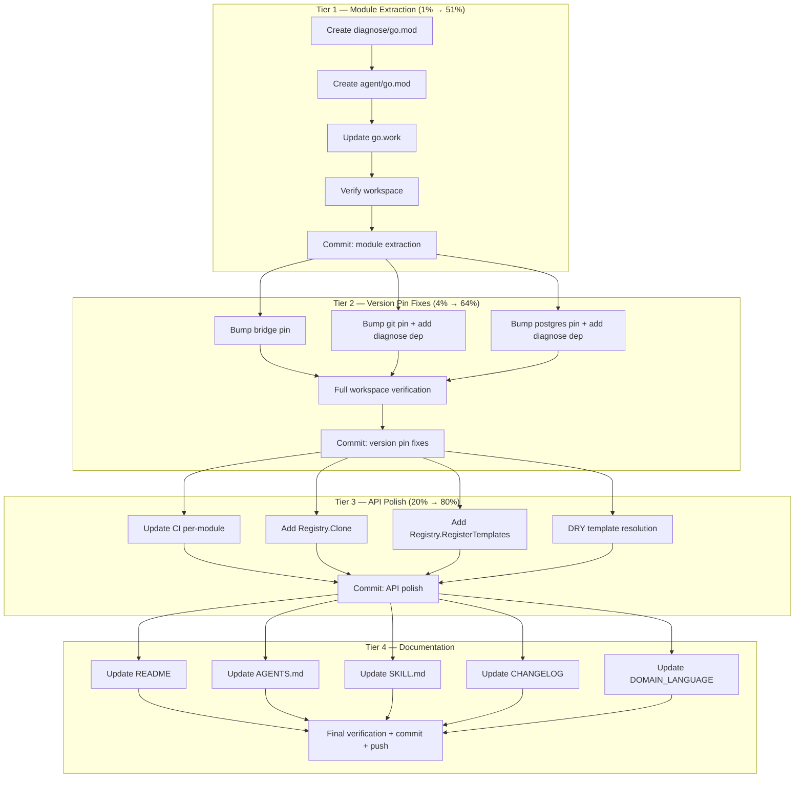

# Execution Plan: Module Extraction & Library Polish

**Date:** 2026-06-17 11:51
**Project:** go-error-family v0.5.0
**Goal:** Extract experimental packages into own modules, fix stale version pins, polish APIs — path to v1.0.

---

## Pareto Breakdown

### The 1% that delivers 51%

**Extract `diagnose/` and `agent/` into their own `go.mod` modules.**

Today the root module mixes the stable classification library with two experimental packages. This means a breaking change to the agent forces a version bump for everyone using just `Classify` and `Family`. Extraction unblocks v1.0 of the stable library. Import paths don't change — `github.com/.../diagnose` works as both a package import and a module path.

### The 4% that delivers 64%

1. Extract `diagnose/` into own module (the 1%)
2. Extract `agent/` into own module (depends on 1)
3. **Bump all submodule version pins** — bridge, git, postgres all pin root at v0.3.0, but v0.5.0 shipped breaking changes (copy-on-write, Registry, `{key}` syntax, Compose removal). External consumers pulling these submodules get a root version that doesn't match the current API.

### The 20% that delivers 80%

1-3 above plus: 4. Add `diagnose` as explicit dependency to git/postgres submodules (they import diagnose types today via root module — after extraction, they need their own require) 5. Update `go.work` to include new modules 6. Update CI with per-module test/lint steps 7. Add `Registry.Clone()` and `Registry.RegisterTemplates()` — consistency with existing patterns 8. DRY `resolveSuggestedFix` and `renderCLI` — they duplicate the same template resolution chain 9. Update all documentation (README, AGENTS.md, SKILL.md, CHANGELOG, DOMAIN_LANGUAGE) for the new structure

### The 80% that delivers 20% (NOT in this plan — deferred)

- CON 05+04: structured `DiagnosticResult` triple + agent rename (needs design discussion)
- v1.0 tagging (product decision — needs explicit approval)
- HTTP status code mapping (`Family.HTTPStatus()`)
- `Error.JSON()` method
- OpenTelemetry/slog integration examples
- Fuzz test for `{key}` template substitution
- Moving files to `internal/` or `pkg/` (would break import paths)

---

## Medium-Granularity Plan (30-100 min each)

| #   | Task                                                                     | Tier | Impact   | Effort | Depends on |
| --- | ------------------------------------------------------------------------ | ---- | -------- | ------ | ---------- |
| 1   | Create `diagnose/go.mod` — extract diagnose package into own module      | 1    | Critical | 30min  | —          |
| 2   | Create `agent/go.mod` — extract agent package into own module            | 1    | Critical | 30min  | 1          |
| 3   | Update `go.work` to add `./diagnose` and `./agent`                       | 1    | Critical | 10min  | 1,2        |
| 4   | Bump bridge root pin from v0.3.0 → v0.5.0                                | 2    | High     | 15min  | —          |
| 5   | Bump git submodule: root → v0.5.0, add diagnose dep                      | 2    | High     | 20min  | 1          |
| 6   | Bump postgres submodule: root → v0.5.0, add diagnose dep                 | 2    | High     | 20min  | 1          |
| 7   | Full workspace verification (build + test + race + lint all modules)     | 2    | High     | 30min  | 1-6        |
| 8   | Update CI: add test/lint steps for diagnose/ and agent/ modules          | 3    | Medium   | 30min  | 7          |
| 9   | Add `Registry.Clone()` method                                            | 3    | Medium   | 20min  | —          |
| 10  | Add `Registry.RegisterTemplates()` batch method                          | 3    | Low      | 15min  | —          |
| 11  | DRY `resolveSuggestedFix` / `renderCLI` — extract shared template lookup | 3    | Medium   | 30min  | —          |
| 12  | Update README for new module structure                                   | 4    | Medium   | 30min  | 7          |
| 13  | Update AGENTS.md (build commands, module structure, coverage)            | 4    | Medium   | 20min  | 7          |
| 14  | Update SKILL.md (architecture overview, module map)                      | 4    | Low      | 20min  | 7          |
| 15  | Update CHANGELOG with v0.6.0 entry                                       | 4    | Medium   | 15min  | 7-11       |
| 16  | Update DOMAIN_LANGUAGE.md if needed                                      | 4    | Low      | 10min  | —          |
| 17  | Bump root go.mod version comment / prepare release notes                 | 4    | Low      | 10min  | 15         |

**17 tasks. Total estimated effort: ~6 hours.**

---

## Fine-Granularity Breakdown (max 15 min each)

### Tier 1 — Module Extraction (the 1%)

| #   | Sub-task                                                               | Parent | Est  |
| --- | ---------------------------------------------------------------------- | ------ | ---- |
| 1.1 | Write `diagnose/go.mod` with module path + require root v0.5.0         | 1      | 5min |
| 1.2 | Run `cd diagnose && go mod tidy`                                       | 1      | 5min |
| 1.3 | Verify `cd diagnose && go build ./...`                                 | 1      | 2min |
| 1.4 | Verify `cd diagnose && go test ./... -race`                            | 1      | 5min |
| 2.1 | Write `agent/go.mod` with module path + require root v0.5.0 + diagnose | 2      | 5min |
| 2.2 | Run `cd agent && go mod tidy`                                          | 2      | 5min |
| 2.3 | Verify `cd agent && go build ./...`                                    | 2      | 2min |
| 2.4 | Verify `cd agent && go test ./... -race`                               | 2      | 5min |
| 3.1 | Edit go.work to add `./diagnose` and `./agent`                         | 3      | 3min |
| 3.2 | Run `go work sync` from root                                           | 3      | 2min |
| 3.3 | Verify `go build ./...` from root (workspace)                          | 3      | 2min |
| 3.4 | Verify `go test ./... -race` from root                                 | 3      | 5min |
| 3.5 | Commit module extraction                                               | 3      | 5min |

### Tier 2 — Version Pin Fixes (the 4%)

| #   | Sub-task                                                                                                            | Parent | Est   |
| --- | ------------------------------------------------------------------------------------------------------------------- | ------ | ----- |
| 4.1 | `cd bridge && go get github.com/larsartmann/go-error-family@v0.5.0`                                                 | 4      | 5min  |
| 4.2 | `cd bridge && go mod tidy`                                                                                          | 4      | 3min  |
| 4.3 | Verify `cd bridge && GOWORK=off go build ./...`                                                                     | 4      | 5min  |
| 5.1 | `cd diagnose/git && go get github.com/larsartmann/go-error-family@v0.5.0`                                           | 5      | 5min  |
| 5.2 | `cd diagnose/git && go get github.com/larsartmann/go-error-family/diagnose@v0.0.0` (placeholder, go.work overrides) | 5      | 5min  |
| 5.3 | `cd diagnose/git && go mod tidy`                                                                                    | 5      | 3min  |
| 5.4 | Verify `cd diagnose/git && GOWORK=off go build ./...` (may fail without published diagnose — verify via go.work)    | 5      | 5min  |
| 6.1 | `cd diagnose/postgres && go get github.com/larsartmann/go-error-family@v0.5.0`                                      | 6      | 5min  |
| 6.2 | `cd diagnose/postgres && go get github.com/larsartmann/go-error-family/diagnose@v0.0.0`                             | 6      | 5min  |
| 6.3 | `cd diagnose/postgres && go mod tidy`                                                                               | 6      | 3min  |
| 6.4 | Verify `cd diagnose/postgres && go build ./...`                                                                     | 6      | 5min  |
| 7.1 | Run full workspace build: `go build ./...`                                                                          | 7      | 5min  |
| 7.2 | Run full workspace tests: `go test ./... -race -count=1`                                                            | 7      | 10min |
| 7.3 | Run lint in each module: `golangci-lint run ./...`                                                                  | 7      | 10min |
| 7.4 | Run standalone builds: `GOWORK=off go build ./...` in root                                                          | 7      | 5min  |
| 7.5 | Commit version pin fixes                                                                                            | 7      | 5min  |

### Tier 3 — API Polish (the 20%)

| #    | Sub-task                                                               | Parent | Est   |
| ---- | ---------------------------------------------------------------------- | ------ | ----- |
| 8.1  | Add CI step for diagnose module test                                   | 8      | 5min  |
| 8.2  | Add CI step for diagnose module lint                                   | 8      | 5min  |
| 8.3  | Add CI step for agent module test                                      | 8      | 5min  |
| 8.4  | Add CI step for agent module lint                                      | 8      | 5min  |
| 8.5  | Commit CI update                                                       | 8      | 5min  |
| 9.1  | Write `Registry.Clone()` method in registry.go                         | 9      | 10min |
| 9.2  | Write test for `Registry.Clone()`                                      | 9      | 10min |
| 9.3  | Verify tests pass                                                      | 9      | 2min  |
| 10.1 | Write `Registry.RegisterTemplates()` method                            | 10     | 10min |
| 10.2 | Write test for `Registry.RegisterTemplates()`                          | 10     | 5min  |
| 11.1 | Extract shared `resolveTemplate(code, cfg, reg)` helper from renderCLI | 11     | 10min |
| 11.2 | Refactor `resolveSuggestedFix` to use shared helper                    | 11     | 10min |
| 11.3 | Refactor `renderCLI` to use shared helper                              | 11     | 10min |
| 11.4 | Verify all template tests pass                                         | 11     | 5min  |
| 11.5 | Commit API polish                                                      | 9-11   | 5min  |

### Tier 4 — Documentation (completing the 20%)

| #    | Sub-task                                                             | Parent | Est   |
| ---- | -------------------------------------------------------------------- | ------ | ----- |
| 12.1 | Update README module structure section                               | 12     | 10min |
| 12.2 | Update README "What It Gives You" for new modules                    | 12     | 10min |
| 12.3 | Update README examples if needed                                     | 12     | 10min |
| 13.1 | Update AGENTS.md Quick Start for per-module commands                 | 13     | 10min |
| 13.2 | Update AGENTS.md workspace modules list                              | 13     | 5min  |
| 13.3 | Update AGENTS.md coverage table                                      | 13     | 5min  |
| 14.1 | Update SKILL.md architecture overview (add diagnose/ agent/ modules) | 14     | 10min |
| 14.2 | Update SKILL.md module map                                           | 14     | 10min |
| 15.1 | Write CHANGELOG v0.6.0 entry                                         | 15     | 15min |
| 16.1 | Check DOMAIN_LANGUAGE.md for stale references                        | 16     | 5min  |
| 16.2 | Update any stale references found                                    | 16     | 5min  |
| 17.1 | Final full verification: build + test + race + lint all modules      | 17     | 10min |
| 17.2 | Commit all documentation                                             | 12-16  | 5min  |
| 17.3 | Final git push                                                       | 17     | 2min  |

**52 sub-tasks total. All ≤15 min each.**

---

## Execution Graph

---

## Safety Constraints

- **NO import path changes** — `github.com/.../diagnose` stays the same as both package and module path
- **NO v1.0 tagging** — that's a product decision requiring explicit approval
- **NO internal/ moves** — would break external consumers
- **NO file renames** — same reason
- **Build must never break** — verify after every step
- **Each commit is a checkpoint** — revertable independently

---

## What's NOT in This Plan (Deferred)

| Item                                                   | Why Deferred                                       |
| ------------------------------------------------------ | -------------------------------------------------- |
| CON 05+04 (structured DiagnosticResult + agent rename) | Needs design discussion — user explicitly deferred |
| v1.0 tagging                                           | Product decision — needs explicit user approval    |
| HTTP status code mapping                               | New feature, not blocking v1.0                     |
| Error.JSON() method                                    | New feature, not blocking                          |
| OpenTelemetry/slog examples                            | Nice-to-have, not blocking                         |
| internal/ or pkg/ restructure                          | Would break import paths — verschlimmbesser risk   |
| Fuzz test for {key} template                           | Good idea but not blocking                         |
