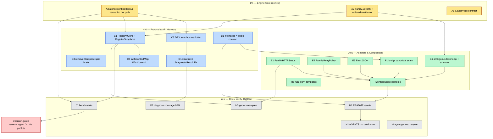

# go-error-family — Superb Architecture Execution Plan

**Created:** 2026-06-20 15:52
**North Star:** Make go-error-family a **superb classification protocol**. Per the architecture decision: **adopt both** — _library layer classifies_ (go-error-family), _application layer enriches_ (samber/oops), _bridge composes_. Prioritization lens: **superb architecture only** — version numbers and adoption metrics are explicitly out of scope.

**Repository:** `/home/lars/projects/go-error-family` (Go workspace, 6 modules: root, agent, bridge, diagnose, diagnose/git, diagnose/postgres)
**Baseline:** clean tree, all tests pass, root coverage 98.4%, 0 lint issues.

---

## Step 2 — Pareto Breakdown

### The 1% that delivers 51% — Classification Engine Core

The engine is the foundation. If `Classify` is wrong (order-dependent, allocates per-call, lies about nil), everything built on it inherits the flaw. Fix the engine first; everything else becomes safer.

- **A2 — Severity-ordered multi-error classification.** Today `Classify` on `errors.Join` returns the _first_ non-Transient sub-error (`registry.go:62-70`) — result depends on argument order, not severity. Introduce `Family.Severity() int` (total order) and pick the **worst** family. Deterministic, preserves fail-closed retry semantics.
- **A3 — Zero-allocation sentinel lookup.** `lookupSentinel` (`registry.go:144-157`) clones the _entire_ sentinels map under RLock on **every** `Classify` call. `Classify` is the hottest path in the library. Replace with `atomic.Pointer[immutableMap]` copy-on-write: reads are lock-free and allocation-free; writes copy-on-write. This is the canonical Go read-heavy-map pattern.
- **A1 — Codify the `Classify(nil)` contract.** Returns `Rejection` (Family zero value). Already documented as "caller's fault" but contradicts the default-Transient philosophy. Make it a **named, documented invariant** rather than a surprise. No behavior change — contract clarity.

### The 4% that delivers 64% — Protocol & API Honesty

Complete the contract surface so the "share the protocol, not the implementation" tagline becomes true, and remove the split brains.

- **B1 — Interfaces become the sole documented public contract.** `Coded`/`Classified`/`Contextual`/`Retryable` are the protocol; `Error` struct is demoted to "reference implementation". Fixes CONTRA #1 (own consumers use the struct because the protocol story is weak).
- **B3 — Kill the `Compose` split brain.** `Compose` (`constructors.go:105`) is a 1-line `errors.Join` wrapper re-added in commit `af59b55`, but CHANGELOG v0.5.0 claims it was _removed_. Either finish the removal (recommended — stdlib `errors.Join` is the protocol, `Classify` already handles multi-errors) or document why it stays. Architecturally: **remove**.
- **C3 — DRY template resolution.** `resolveSuggestedFix` (`handle.go:234`) and `renderCLI` (`handle.go:208`) both walk override→registry→default→fallback independently. Extract one `resolveTemplate(code, ctx, cfg, reg)` helper.
- **C1 — Complete the `Registry` API.** Add `Registry.Clone()` (inherit-and-extend) and `Registry.RegisterTemplates(map)` (batch — parity with `RegisterClassifications`).
- **C2 — Complete the context API.** Add `Error.WithContextMap(map[string]string)` (batch) and `Error.WithContextf(key, format, args...)` (formatted).
- **D1 — Structured `DiagnosticResult.Fix`.** Replace freeform `SuggestedFix string` with a `Fix struct{Summary, Command, Rationale string}`. Kills the `extractCommand` prose-parsing heuristic (CON 05+04).

### The 20% that delivers 80% — Adapters, Composition & Guidance

Show the architecture in action and close the ambiguous-taxonomy gap.

- **E1 — `Family.HTTPStatus()`** — Rejection→400, Conflict→409, Transient→503, Corruption→500, Infrastructure→503.
- **E2 — `Family.RetryPolicy()`** — sensible backoff defaults (max attempts, min/max delay) derived from family.
- **E3 — `Error.JSON()`** — structured JSON for API boundaries.
- **F1 — Bridge as canonical composition seam.** Document "library classifies, app enriches" as the architecture; the bridge is the _only_ place both meet.
- **F2 — Integration examples** — slog severity, HTTP middleware (Family→status), OpenTelemetry span attributes.
- **G1 — Ambiguous-taxonomy guidance.** Document where `context.Canceled`, `context.DeadlineExceeded`, HTTP 429/401 land; ship a `stderrors` helper package with registered defaults.

### Everything else (the 80% effort / 20% result)

Docs polish, discoverability, coverage, benchmarks, and decision-gated items (agent rename, v1.0 tagging — deprioritized per "ignore version numbers").

---

## Step 3 — Comprehensive Plan (medium tasks, 30–100 min)

Sorted by **impact desc, effort asc**. 22 tasks.

| #   | ID  | Task                                                      | Theme              | Impact (1-5) | Effort (min) | Tier |
| --- | --- | --------------------------------------------------------- | ------------------ | :----------: | :----------: | :--: |
| 1   | A3  | Zero-alloc atomic sentinel lookup                         | Engine perf        |      5       |      60      |  1%  |
| 2   | A2  | Severity-ordered multi-error Classify                     | Engine correctness |      5       |      55      |  1%  |
| 3   | C3  | DRY template resolution helper                            | Split brain        |      5       |      45      |  4%  |
| 4   | D1  | Structured `DiagnosticResult.Fix` triple                  | Diagnostics        |      5       |      80      |  4%  |
| 5   | B3  | Remove `Compose` + fix CHANGELOG split brain              | Split brain        |      4       |      30      |  4%  |
| 6   | C1  | `Registry.Clone()` + `RegisterTemplates()`                | API completeness   |      4       |      50      |  4%  |
| 7   | B1  | Interfaces = sole public contract (docs + Error demotion) | Protocol honesty   |      4       |      60      |  4%  |
| 8   | C2  | `WithContextMap` + `WithContextf`                         | API completeness   |      4       |      45      |  4%  |
| 9   | E1  | `Family.HTTPStatus()`                                     | Transport adapter  |      4       |      40      | 20%  |
| 10  | G1  | Ambiguous-taxonomy guidance + `stderrors` pkg             | Taxonomy           |      4       |      75      | 20%  |
| 11  | A1  | Codify `Classify(nil)` invariant (docs)                   | Contract clarity   |      3       |      25      |  1%  |
| 12  | E2  | `Family.RetryPolicy()`                                    | Retry adapter      |      3       |      50      | 20%  |
| 13  | E3  | `Error.JSON()`                                            | Transport          |      3       |      45      | 20%  |
| 14  | F1  | Document bridge as canonical composition seam             | Architecture       |      3       |      55      | 20%  |
| 15  | H6  | Fuzz test for `{key}` template substitution               | Safety             |      3       |      40      | 20%  |
| 16  | F2  | Integration examples (slog/HTTP/OTel)                     | Composition        |      3       |      90      | 20%  |
| 17  | D2  | Diagnose coverage 77.3% → 90%                             | Quality            |      2       |      80      | 20%  |
| 18  | H1  | README rewrite around layered architecture                | Docs               |      2       |      70      | rest |
| 19  | H3  | Go doc examples (`ExampleNewRegistry` etc.)               | Discoverability    |      2       |      50      | rest |
| 20  | J1  | Benchmarks: atomic lookup + Registry vs Classify          | Verification       |      2       |      45      | rest |
| 21  | H2  | AGENTS.md per-module quick start + update                 | Docs               |      2       |      35      | rest |
| 22  | I4  | Fix `agent/go.mod` missing diagnose require               | Module hygiene     |      2       |      20      | rest |

**Decision-gated (NOT executed unilaterally — flagged for user):**

- **I1 — Rename `agent` → RCA/Synthesizer.** Status report: "user explicitly deferred for design discussion."
- **I2 — v1.0 tagging / publish strategy.** User deprioritized ("ignore version numbers").
- **I3 — Remove replace-directive chain.** Depends on publish; deprioritized.

---

## Step 4 — Detailed Breakdown (fine tasks, ≤15 min)

Sorted by impact desc, effort asc. 78 tasks. Each is a single verifiable unit.

### Tier 1% — Engine Core

| #   | Task                                                                    | File(s)           | Impact | min |
| --- | ----------------------------------------------------------------------- | ----------------- | :----: | :-: |
| 1   | Read `registry.go` lookupSentinel + Classify multi-error fully          | registry.go       |   5    |  8  |
| 2   | Add `Family.Severity() int` method (Transient1<Rej2<Conf3<Infra4<Corr5) | family.go         |   5    | 10  |
| 3   | Add `Severity()` test + table                                           | family_test.go    |   5    | 10  |
| 4   | Rewrite multi-error Classify to pick max-severity sub-error             | registry.go       |   5    | 12  |
| 5   | Update multi-error tests (order-independence, fail-closed kept)         | registry_test.go  |   5    | 12  |
| 6   | Add `atomic.Pointer` immutable sentinels map type                       | registry.go       |   5    | 12  |
| 7   | Rewrite Register/Unregister copy-on-write storing pointer               | registry.go       |   5    | 12  |
| 8   | Rewrite lookupSentinel lock-free load + iterate                         | registry.go       |   5    | 10  |
| 9   | Add concurrency test (parallel Register + Classify)                     | registry_test.go  |   5    | 12  |
| 10  | Benchmark lookupSentinel before/after alloc (count allocs/op)           | benchmark_test.go |   5    | 12  |
| 11  | Document `Classify(nil) → Rejection` as named invariant                 | classify.go doc   |   3    |  8  |
| 12  | Add nil-input test asserting documented behavior                        | classify_test.go  |   3    |  8  |

### Tier 4% — Protocol & API Honesty

| #   | Task                                                               | File(s)            | Impact | min |
| --- | ------------------------------------------------------------------ | ------------------ | :----: | :-: |
| 13  | Read handle.go renderCLI + resolveSuggestedFix fully               | handle.go          |   5    | 10  |
| 14  | Extract `resolveTemplate(code,ctx,cfg,reg) (MessageTemplate,bool)` | handle.go          |   5    | 12  |
| 15  | Refactor renderCLI to use resolveTemplate                          | handle.go          |   5    | 12  |
| 16  | Refactor resolveSuggestedFix to use resolveTemplate                | handle.go          |   5    | 12  |
| 17  | Verify handle tests green; dedup test additions                    | handle_test.go     |   5    | 10  |
| 18  | Remove `Compose` from constructors.go                              | constructors.go    |   4    |  8  |
| 19  | Remove Compose tests; replace with `errors.Join` usage note        | constructors tests |   4    | 10  |
| 20  | Fix CHANGELOG: move Compose to "Removed", document re-add/removal  | CHANGELOG.md       |   4    | 10  |
| 21  | Add `Registry.Clone() *Registry` (deep copy sentinels+templates)   | registry.go        |   4    | 12  |
| 22  | Add Clone test (independence from DefaultRegistry)                 | registry_test.go   |   4    | 12  |
| 23  | Add `Registry.RegisterTemplates(map[string]MessageTemplate)`       | registry.go        |   4    | 10  |
| 24  | Add RegisterTemplates test + parity assertion                      | registry_test.go   |   4    | 10  |
| 25  | Add `Error.WithContextMap(map[string]string) *Error`               | error.go           |   4    | 12  |
| 26  | Add `Error.WithContextf(key, format, args...) *Error`              | error.go           |   4    | 12  |
| 27  | Add tests for WithContextMap + WithContextf                        | error_test.go      |   4    | 12  |
| 28  | Read diagnose.go DiagnosticResult + extractCommand usage           | diagnose.go        |   5    | 10  |
| 29  | Define `Fix struct{Summary,Command,Rationale string}`              | diagnose.go        |   5    | 10  |
| 30  | Replace `SuggestedFix string` with `Fix Fix`; keep compat accessor | diagnose.go        |   5    | 12  |
| 31  | Update all rules returning SuggestedFix → populate Fix             | diagnose rules     |   5    | 12  |
| 32  | Remove/deprecate `extractCommand` heuristic                        | diagnose           |   5    | 12  |
| 33  | Update diagnose tests for structured Fix                           | diagnose tests     |   5    | 12  |
| 34  | Document interfaces as sole public contract in doc.go              | doc.go             |   4    | 12  |
| 35  | Add "reference implementation" note to Error struct                | error.go           |   4    |  8  |
| 36  | Document `Error.Is` (code+family) matching semantics               | error.go           |   4    | 10  |

### Tier 20% — Adapters, Composition & Guidance

| #   | Task                                                          | File(s)              | Impact | min |
| --- | ------------------------------------------------------------- | -------------------- | :----: | :-: |
| 37  | Add `Family.HTTPStatus() int` mapping table                   | family.go            |   4    | 12  |
| 38  | Add HTTPStatus test (all 5 families)                          | family_test.go       |   4    | 10  |
| 39  | Add `RetryPolicy struct{MaxAttempts,MinDelay,MaxDelay}`       | family.go            |   3    | 12  |
| 40  | Add `Family.RetryPolicy() RetryPolicy` defaults               | family.go            |   3    | 12  |
| 41  | Add RetryPolicy test                                          | family_test.go       |   3    | 10  |
| 42  | Add `Error.JSON() ([]byte,error)` via encoding/json           | error.go             |   3    | 12  |
| 43  | Add JSON test (round-trip fields)                             | error_test.go        |   3    | 12  |
| 44  | Create `stderrors/` pkg registering ctx.Canceled etc.         | stderrors/           |   4    | 12  |
| 45  | Document ambiguous-taxonomy mapping table in README/AGENTS    | docs                 |   4    | 12  |
| 46  | Add fuzz test for `{key}` substitution (injection/double-sub) | fuzz_test.go         |   3    | 12  |
| 47  | Write slog severity example                                   | examples/            |   3    | 12  |
| 48  | Write HTTP middleware example (Family→status)                 | examples/            |   3    | 12  |
| 49  | Write OpenTelemetry span-attributes example                   | examples/            |   3    | 12  |
| 50  | Document "library classifies, app enriches" architecture      | bridge/README + root |   3    | 12  |
| 51  | Add bridge composition example (oops→bridge→classify)         | examples/            |   3    | 12  |

### Tier rest — Docs, Discoverability, Verification, Hygiene

| #   | Task                                                            | File(s)           | Impact | min |
| --- | --------------------------------------------------------------- | ----------------- | :----: | :-: |
| 52  | Benchmark `Registry.Classify` vs package `Classify` indirection | benchmark_test.go |   2    | 12  |
| 53  | Improve diagnose coverage: FilesystemRule edge cases            | diagnose tests    |   2    | 12  |
| 54  | Improve diagnose coverage: NetworkRule edge cases               | diagnose tests    |   2    | 12  |
| 55  | Improve diagnose coverage: Runner concurrency                   | diagnose tests    |   2    | 12  |
| 56  | Add `ExampleNewRegistry` godoc example                          | registry.go       |   2    | 10  |
| 57  | Add `ExampleClassify` godoc example                             | classify.go       |   2    | 10  |
| 58  | Add `ExampleError_WithContext` godoc example                    | error.go          |   2    | 10  |
| 59  | README: rewrite intro around layered architecture               | README.md         |   2    | 12  |
| 60  | README: comparison table vs oops (complementary framing)        | README.md         |   2    | 12  |
| 61  | README: update module landscape (6 modules)                     | README.md         |   2    | 10  |
| 62  | AGENTS.md: per-module build/test quick start                    | AGENTS.md         |   2    | 12  |
| 63  | AGENTS.md: add severity + atomic-lookup notes                   | AGENTS.md         |   2    | 10  |
| 64  | AGENTS.md: add HTTPStatus/RetryPolicy/JSON notes                | AGENTS.md         |   2    | 10  |
| 65  | CONTRIBUTING.md: add Registry pattern section                   | CONTRIBUTING.md   |   1    | 12  |
| 66  | Fix `agent/go.mod`: add explicit diagnose require               | agent/go.mod      |   2    |  8  |
| 67  | Verify go.work build across all 6 modules                       | workspace         |   2    | 10  |
| 68  | Run full test suite race + lint all modules                     | workspace         |   2    | 12  |
| 69  | Run fuzz corpus for ParseFamily + Classify + templates          | workspace         |   2    | 12  |
| 70  | Migrate docs/status + docs/planning to docs/archive/            | docs              |   1    | 12  |

### Decision-gated (require user input — NOT auto-executed)

| #   | Task                                                   | Why gated                                   |
| --- | ------------------------------------------------------ | ------------------------------------------- |
| 71  | Rename `agent` package → RCA/Synthesizer               | User deferred for design discussion         |
| 72  | Tag root module v1.0                                   | "Ignore version numbers"                    |
| 73  | Publish root version deleting agent/diagnose dirs      | Depends on publish strategy                 |
| 74  | Remove replace-directive chain                         | Depends on #73                              |
| 75  | `errors.Join` pre-classifying wrapper `(error,Family)` | YAGNI — recommend SKIP unless concrete need |
| 76  | i18n hook for familyData messages                      | No current consumer need                    |
| 77  | Shorter import alias (`errfam`)                        | Cosmetic, breaking                          |
| 78  | Re-evaluate Go 1.26 → lower requirement                | User: ignore version constraints            |

---

## Execution Graph



**Dependencies rationale:**

- `A3` (atomic lookup) unblocks `C1` (Registry API — build on the new store) and `J1` (benchmark the change).
- `A2` (severity) unblocks `G1` (taxonomy guidance uses severity ordering).
- `C3` (DRY templates) unblocks `D1` (Fix field flows through template resolution).
- `B1` (protocol honesty) unblocks `F1` (the composition story rests on "protocol not impl").
- All adapters (`E*`, `G1`, `F1`) unblock `F2` (examples that demonstrate them).
- `D1` unblocks `D2` (can't raise coverage until the struct stabilizes).

---

## Verification Gates (run after each tier)

```bash
go test ./... -count=1 -timeout 120s -race    # root + workspace
golangci-lint run ./...                         # all modules
go build ./examples/...                         # examples compile
go test -fuzz=FuzzParseFamily -fuzztime=10s .   # fuzz spot-check
```

**Success criteria per tier:**

- **1%:** allocs/op in `BenchmarkClassify_WithSentinel` drops to 0 for the lookup; multi-error classification is order-independent in tests.
- **4%:** `grep -r "resolveTemplate"` shows one helper; `Compose` gone; new Registry/context methods have tests.
- **20%:** all adapter methods have table tests; examples compile in CI; bridge docs land.

---

_North Star reminder: every change must make the classification protocol more correct, more honest, or more complete. If a change does none of these, it does not belong in this plan._
