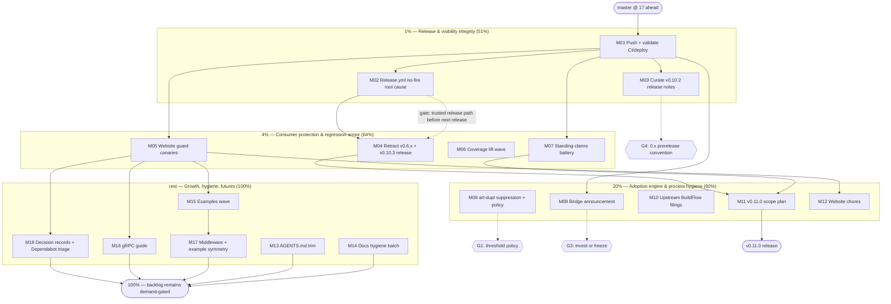

# Superb Pareto Execution Plan — From Release Integrity to Ecosystem Growth

**Created:** 2026-09-28 01:50 CEST
**Branch:** `master` (17 commits ahead of origin at plan time — push is step 1 of the plan)
**Scope:** ALL open TODOs — the 10 TODO_LIST items, ROADMAP raw ideas + 3 Open Questions, and this session's loose ends. Nothing dropped; everything routed.
**Method:** Pareto tiers (1% → 51%, 4% → 64%, 20% → 80%, remainder → 100%), then medium tasks (30–100 min), then fine tasks (≤12 min). Sorted by importance/impact/effort/customer-value.

---

## Step 2 — The Pareto Breakdown

### The 1% that delivers 51% — Release & visibility integrity

Three work items. Without them, everything else is invisible or unsafe:

| #  | Item                                   | Why it is the 1%                                                                                                                                                        |
| -- | -------------------------------------- | ----------------------------------------------------------------------------------------------------------------------------------------------------------------------- |
| 1  | **Push the 17 local commits + validate** | The entire docs pass, the v0.10.2 remediation, and two `website/**` fixes are local-only. Until pushed: zero CI validation, zero deploy of the mdx fixes, zero public visibility. One command unlocks proof for everything. |
| 2  | **Root-cause the release.yml no-fire** (v0.10.2) | The release gate silently skipped the current release. Until diagnosed, **v0.11.0 will silently skip it too** — no GitHub Release, no curated notes, no release-time test gate. This is a correctness hole in the supply path. |
| 3  | **Curate the v0.10.2 GitHub Release notes** | The "Latest" release page is currently auto-generated noise. It is the first thing a new consumer sees after pkg.go.dev. 30 minutes, outsized trust effect.                                       |

### The 4% that delivers 64% — Consumer protection & regression armor

The 1%, plus four items that directly protect consumers and stop known recurrence classes:

| #  | Item                                        | Why it is the next 3%                                                                                                                                          |
| -- | -------------------------------------------- | --------------------------------------------------------------------------------------------------------------------------------------------------------------- |
| 4  | **Retract the broken v0.6.x tag family**     | Broken phantom-`replace` tags are `go get`-able TODAY. Real consumer harm, fix is mechanical, verified open since 2026-09-18.                                    |
| 5  | **Website guard canaries + Dependabot decision** | The TS-7/lockfile class broke `website-deploy` THREE times; nothing structural prevents a fourth. A 12-line CI canary ends the class.                            |
| 6  | **Coverage lift wave** (git 91.0→95, diagnose 84.2→88, postgres 78.5→83) | The v0.10.1 erraudit error-branches are untested — the protocol's most-used diagnostic paths can regress silently.                                             |
| 7  | **Standing-claims battery** (erraudit, structure-linter, buildflow full no-cache, website nix build) | Four claims in AGENTS/FEATURES decay silently; one battery run re-anchors them with dates.                                                                      |

### The 20% that delivers 80% — Adoption engine & process hygiene

The 4%, plus the items that grow adoption and stop process churn:

| #  | Item                                            | Why it is the next 16%                                                                                                       |
| -- | ------------------------------------------------ | ------------------------------------------------------------------------------------------------------------------------------ |
| 8  | **Announce the Bridge Patterns guide**           | The #1 adoption unblocker shipped in v0.10.1 and nothing has put it in front of oops users. Pure demand-side work.             |
| 9  | **art-dupl suppression + threshold policy**      | Stops the accepted clone from being re-litigated on every deep sweep; closes ROADMAP Open Question 1.                          |
| 10 | **Upstream BuildFlow filings** (pnpm-audit subdirectory lockfiles; phantom IsIgnored) | Fleet-wide value; each accepted upstream fix removes one standing skip in this repo. verify-before-filing gated.                |
| 11 | **v0.11.0 scope plan**                           | Converts the post-canary backlog into a releasable unit; the CHANGELOG skeleton makes the next release a formality.             |
| 12 | **Website chores** (`minimumReleaseAgeStrict`)   | Cheap supply-chain freshness knob; last open website chore after the canaries.                                                  |

### The rest to 100% — Growth, hygiene, futures

Everything else, scheduled AFTER the tiers above (they are real, but none of them protects a consumer or unblocks a release):

- **Hygiene:** AGENTS.md trim (<30 KB), `sec-consumer-feedback.md` annotate+archive, `go.work` floor comment, `best-of-both-worlds.html` reference check, peripheral doc surfaces audit record, `docs/status/` index, CI md-link check, Dependabot branch triage.
- **Docs/adoption growth:** examples for `errorfamilytest` + `diagnose`, HTTPHandler middleware example, constructor example symmetry, gRPC status-mapping guide.
- **Futures (gated, next-major or demand-triggered):** OpenAPI schema, `httperror` RFC, redis/docker/kubectl submodules, typed `DiagnosticResult.Details`, `Code()`/`ErrorCode()` convergence, benchmark suite across versions, consumer survey refresh, release automation script, CSP + uptime-monitor decisions.

### Decision gates (user input required — the plan routes around them, never blocks on them)

| Gate | Question | Blocked items |
| ---- | -------- | ------------- |
| G1 | ROADMAP OQ1: art-dupl `-t 1` routine vs deep-sweep | M09 policy half |
| G2 | ROADMAP OQ2: fleet churn root-fix vs per-repo canaries forever | none (canaries are correct either way) |
| G3 | ROADMAP OQ3: bridge/enrichment — invest or freeze | M08 proceeds; items 31-37 pace follows the answer |
| G4 | 0.x GitHub releases: full vs prerelease marking | M03 recommendation |

### Gate resolutions (recorded as they land)

- **G4 (resolved 2026-09-28, recommendation): keep 0.x releases marked FULL.** Prerelease
  flag should reflect literal `alpha`/`beta`/`rc` suffixes only (current release.yml
  behavior — now suffix-based on the resolved tag, not `github.ref_name`). Rationale: 0.x is
  this project's stability contract with 50+ production consumers; marking every 0.x
  "Pre-release" would hide releases from Latest-filtering consumers and understate real
  stability guarantees. Semver 0.x caveat is already documented in the README. Revisit only
  if a consumer survey says otherwise.

---

## Step 3 — Comprehensive Plan: medium tasks (30–100 min each)

ALL TODOs, sorted by tier, then impact ÷ effort. Customer-value stars: ★★★ (consumer-facing) ★★ (maintainer-facing) ★ (internal).

| #   | Tier | Task (30–100 min)                                                                                                                     | Impact | Effort | Value | Depends |
| --- | ---- | -------------------------------------------------------------------------------------------------------------------------------------- | ------ | ------ | ----- | ------- |
| M01 | 1%   | **Push `master` (17 commits) + validate**: watch CI and `website-deploy` on the docs sweep + mdx fixes; triage any red                   | ★★★    | 30m    | ★★★   | —       |
| M02 | 1%   | **Root-cause release.yml no-fire on v0.10.2**: diff workflow at both tags, inspect events via `gh api`, write findings, add `workflow_dispatch` fallback + AGENTS runbook line. NO tag re-pointing | ★★★    | 60m    | ★★★   | —       |
| M03 | 1%   | **Curate v0.10.2 GitHub Release**: summary + 7-module table (v0.10.1 style); draft 0.x-prerelease recommendation (G4)                     | ★★     | 30m    | ★★★   | M01     |
| M04 | 4%   | **Retract v0.6.x family**: `retract` block with reason comments → coordinated v0.10.3 patch release (sub-tags first) → verify `go list -m -versions` + proxy render → GH release + website changelog sync | ★★★    | 90m    | ★★★   | M02     |
| M05 | 4%   | **Website guard canaries**: CI workflow on `website/**` (typescript major == 6, `pnpm install --frozen-lockfile`, `astro check`); Dependabot `/website` decision documented | ★★★    | 60m    | ★★    | M01     |
| M06 | 4%   | **Coverage lift wave**: diagnose/git 91.0→95 (erraudit error-branch tests), diagnose 84.2→88 (helper/rule paths), postgres 78.5→83 (scenario tests); update FEATURES/AGENTS tables | ★★     | 90m    | ★★    | —       |
| M07 | 4%   | **Standing-claims battery**: erraudit (7 modules), go-structure-linter CLI, `buildflow --build-mode full` (no result cache), website flake `nix build`; record dated results | ★★     | 45m    | ★★    | M01     |
| M08 | 20%  | **Bridge Patterns announcement**: draft with github-voice skill → self-review vs guide → user review gate → publish (r/golang or short post) | ★★★    | 90m    | ★★★   | M01     |
| M09 | 20%  | **art-dupl suppression + policy**: capability check (excludes/baseline), wire the accepted `strTrue`/`strFalse` clones, record threshold policy in AGENTS (G1) | ★      | 40m    | ★     | —       |
| M10 | 20%  | **Upstream BuildFlow filings** ×2: pnpm-audit subdirectory lockfiles; phantom analyzer `IsIgnored` — minimal repros, verify-before-filing gate | ★★     | 60m    | ★★    | —       |
| M11 | 20%  | **v0.11.0 scope plan**: pick from post-M04/M05 backlog, draft CHANGELOG `[Unreleased]` skeleton, write release checklist                   | ★★     | 45m    | ★★    | M07     |
| M12 | 20%  | **Website chores**: `minimumReleaseAgeStrict` evaluation + `pnpm-workspace.yaml` edit + lockfile check                                    | ★      | 30m    | ★     | M05     |
| M13 | rest | **AGENTS.md trim** to <30 KB: move release-era narratives to `docs/history/agents-archive.md`, keep current-state rules, verify citations  | ★      | 60m    | ★     | —       |
| M14 | rest | **Docs hygiene batch**: annotate+archive `sec-consumer-feedback.md`; `go.work` floor comment; `best-of-both-worlds.html` reference check; peripheral-surface audit record | ★      | 45m    | ★     | —       |
| M15 | rest | **Examples wave**: `errorfamilytest/example_test.go` + `diagnose` RuleSpec example (pkg.go.dev discoverability gap)                        | ★★     | 90m    | ★★    | M05     |
| M16 | rest | **gRPC status-mapping guide** (family → `codes.Internal`/`Unavailable`/`InvalidArgument`) on the website, sidebar-linked                  | ★★     | 90m    | ★★    | M05     |
| M17 | rest | **HTTPHandler middleware example + constructor example symmetry** (`ExampleNewConflict/Corruption/Infrastructure/Orchestration`)           | ★      | 30m    | ★     | M15     |
| M18 | rest | **Decision records + triage**: CSP for website (adopt or formally decline), uptime monitor (adopt or decline), 6 open Dependabot branches  | ★      | 30m    | ★     | M05     |

**Backlog (recorded in ROADMAP, deliberately unscheduled — demand-gated or next-major):** OpenAPI schema · `httperror` RFC · redis/docker/kubectl submodules · typed `DiagnosticResult.Details` · `Code()`/`ErrorCode()` convergence · benchmark suite across versions · consumer survey refresh · release automation script · Echo/Gin guides. These are 100%-completers; none blocks the tiers above.

---

## Step 4 — Fine-Grained Plan: every task ≤ 12 min

| ID    | ≤12 min task                                                                                  | Parent | Tier |
| ----- | ------------------------------------------------------------------------------------------------ | ------ | ---- |
| F01.1 | Pre-push sanity: `GOWORK=off go build ./...` + `git status -sb` + confirm clean tree            | M01    | 1%   |
| F01.2 | `git push origin master` (17 commits + this plan)                                               | M01    | 1%   |
| F01.3 | Watch CI run to completion (`gh run watch` / `gh run list`)                                     | M01    | 1%   |
| F01.4 | Watch `website-deploy` run (fires on the `.mdx` fixes)                                          | M01    | 1%   |
| F01.5 | Triage any red leg (or record both-green evidence)                                              | M01    | 1%   |
| F02.1 | `git diff v0.10.1 v0.10.2 -- .github/workflows/release.yml`                                     | M02    | 1%   |
| F02.2 | `gh api` list workflow runs filtered to the tag ref + check events payload                      | M02    | 1%   |
| F02.3 | Check tag+branch same-push behavior vs v0.10.1 timeline; write findings note                    | M02    | 1%   |
| F02.4 | Add `workflow_dispatch` fallback to release.yml (manual gate re-run path)                       | M02    | 1%   |
| F02.5 | AGENTS.md release section: one-line runbook ("verify Release run started within ~2 min of tag push") | M02 | 1%   |
| F03.1 | Draft v0.10.2 summary + modules table from CHANGELOG                                            | M03    | 1%   |
| F03.2 | `gh release edit v0.10.2 --notes-file -`                                                        | M03    | 1%   |
| F03.3 | Write 0.x-prerelease recommendation (G4) into the report/questions                              | M03    | 1%   |
| F04.1 | Write `retract` block in root `go.mod` (v0.6.0, v0.6.1 + reason comments → v0.10.3)             | M04    | 4%   |
| F04.2 | `go mod edit` submodule self-requires → v0.10.3 family; tidy sums                               | M04    | 4%   |
| F04.3 | Draft CHANGELOG `[0.10.3]` section (retraction + pins)                                          | M04    | 4%   |
| F04.4 | Verify: workspace tests + `GOWORK=off go build` per submodule                                   | M04    | 4%   |
| F04.5 | Cut 7 annotated tags at the release commit (sub-tags first)                                     | M04    | 4%   |
| F04.6 | Push sub-tags → root tag + master (sequence per AGENTS runbook)                                 | M04    | 4%   |
| F04.7 | Poll `proxy.golang.org .../@v/list` until v0.10.3 resolves                                      | M04    | 4%   |
| F04.8 | `GOWORK=off go list -m -versions` → confirm retracted flags render                              | M04    | 4%   |
| F04.9 | Curated GitHub Release v0.10.3 (notes include retraction notice)                                | M04    | 4%   |
| F04.10| Sync website `changelog.mdx` + ROADMAP theme 3 note                                             | M04    | 4%   |
| F05.1 | Create `website-check` CI job skeleton (path filter `website/**`)                               | M05    | 4%   |
| F05.2 | Step: fail if `website/package.json` typescript major ≠ 6                                       | M05    | 4%   |
| F05.3 | Step: `pnpm install --frozen-lockfile` + `astro check` in `website/`                            | M05    | 4%   |
| F05.4 | Validate the workflow on a scratch branch before merging                                        | M05    | 4%   |
| F05.5 | AGENTS.md: record the Dependabot `/website` decision + residual manual-audit cadence            | M05    | 4%   |
| F06.1 | Test: diagnose/git run-error branches (StatusUnknown paths) — batch 1                           | M06    | 4%   |
| F06.2 | Test: diagnose/git run-error branches — batch 2 (remote/ls-remote)                              | M06    | 4%   |
| F06.3 | Test: diagnose helpers edge paths (ResolveContextKey, matching)                                 | M06    | 4%   |
| F06.4 | Test: diagnose rule paths (filesystem/network uncovered branches)                               | M06    | 4%   |
| F06.5 | Test: postgres scenario batch 1 (pg_isready error paths)                                        | M06    | 4%   |
| F06.6 | Test: postgres scenario batch 2 (TCP/start suggestion)                                          | M06    | 4%   |
| F06.7 | Re-run `go test -cover` all modules; diff vs baselines                                          | M06    | 4%   |
| F06.8 | Update FEATURES + AGENTS coverage tables with new date                                          | M06    | 4%   |
| F07.1 | `erraudit` sweep across all modules; expect 0                                                    | M07    | 4%   |
| F07.2 | `go-structure-linter` CLI with `.go-structure-linter.yaml`; expect exit 0                        | M07    | 4%   |
| F07.3 | `BUILDFLOW_NO_RESULT_CACHE=1 buildflow --build-mode full`; expect 0 failed                      | M07    | 4%   |
| F07.4 | `nix build` of `website/flake.nix`                                                              | M07    | 4%   |
| F07.5 | Record dated battery results in AGENTS (claims re-anchored)                                     | M07    | 4%   |
| F08.1 | Load github-voice skill; review Bridge guide + examples README                                   | M08    | 20%  |
| F08.2 | Draft announcement (three patterns + decision guide + links)                                     | M08    | 20%  |
| F08.3 | Self-review against guide content (no overclaiming; zero-consumers honesty)                      | M08    | 20%  |
| F08.4 | User review gate                                                                                 | M08    | 20%  |
| F08.5 | Publish + cross-link from README discussions/related channels                                    | M08    | 20%  |
| F09.1 | `art-dupl --help` capability check: excludes/baseline support?                                   | M09    | 20%  |
| F09.2 | Wire `strTrue`/`strFalse` acceptance into exclusion/baseline (if supported)                      | M09    | 20%  |
| F09.3 | Write threshold policy (`-t 1` vs `-t 5`) into AGENTS (G1 pending → record default)              | M09    | 20%  |
| F10.1 | Minimal repro: pnpm-audit fails without subdirectory lockfile discovery                          | M10    | 20%  |
| F10.2 | File BuildFlow issue A (with repro + fleet impact)                                               | M10    | 20%  |
| F10.3 | Minimal repro: phantom analyzer ignores `IsIgnored` in `pkg/phantom`                             | M10    | 20%  |
| F10.4 | File BuildFlow issue B                                                                           | M10    | 20%  |
| F10.5 | Link both filings from `.buildflow.yml` skip comments                                            | M10    | 20%  |
| F11.1 | Pick v0.11.0 scope: canaries + examples wave + coverage (post-M04 leftovers)                     | M11    | 20%  |
| F11.2 | Draft CHANGELOG `[Unreleased]` skeleton entries                                                  | M11    | 20%  |
| F11.3 | Write the release checklist into TODO_LIST (bounded items)                                       | M11    | 20%  |
| F12.1 | Evaluate `minimumReleaseAgeStrict` (docs + our lockfile cadence)                                 | M12    | 20%  |
| F12.2 | Apply decision to `website/pnpm-workspace.yaml` + verify install                                 | M12    | 20%  |
| F13.1 | Inventory AGENTS bullets: current-rule vs release-narrative                                      | M13    | rest |
| F13.2 | Move narratives to `docs/history/agents-archive.md` (verbatim, non-destructive)                  | M13    | rest |
| F13.3 | Rewrite trimmed AGENTS; keep every still-true gotcha                                             | M13    | rest |
| F13.4 | Verify no internal citation broke (grep referenced paths)                                        | M13    | rest |
| F13.5 | `wc -c AGENTS.md` < 30 KB; record size in report                                                 | M13    | rest |
| F14.1 | Annotate `sec-consumer-feedback.md` (D/S tables → current truth)                                 | M14    | rest |
| F14.2 | `git mv` to `docs/feedback/archived/`                                                            | M14    | rest |
| F14.3 | Add `go.work` floor comment (1.26.7 toolchain rationale)                                         | M14    | rest |
| F14.4 | Grep `best-of-both-worlds.html` references; archive or restore                                   | M14    | rest |
| F14.5 | Record peripheral-surface grep-audit results (research/, modularization/, top-5 docs)            | M14    | rest |
| F15.1 | Write `errorfamilytest/example_test.go` (AssertFamily/Code/Retryable/Context)                    | M15    | rest |
| F15.2 | Verify examples render on pkg.go.dev (test + doc preview)                                        | M15    | rest |
| F15.3 | Write `diagnose` RuleSpec example (data-driven rule pattern)                                     | M15    | rest |
| F15.4 | Add matching helpers example (`ResolveContextKey`)                                               | M15    | rest |
| F15.5 | `go test -race` + lint in both modules                                                           | M15    | rest |
| F15.6 | Mention new examples in README test-helpers + diagnostic sections                                | M15    | rest |
| F16.1 | Map 6 families → gRPC codes (retryable → Unavailable, Rejection → InvalidArgument, …)           | M16    | rest |
| F16.2 | Write `guides/grpc.mdx` (interceptor pattern + table + example)                                  | M16    | rest |
| F16.3 | Sidebar entry + cross-links from HTTP guide                                                      | M16    | rest |
| F16.4 | `astro check` + `astro build` green                                                              | M16    | rest |
| F17.1 | HTTPHandler middleware example (chi-style wrapper, stdlib only)                                  | M17    | rest |
| F17.2 | Constructor example symmetry: `ExampleNewConflict/Corruption/Infrastructure/Orchestration`       | M17    | rest |
| F17.3 | Test + lint + examples count update in FEATURES                                                  | M17    | rest |
| F18.1 | CSP decision record (adopt minimal policy vs formally decline + rationale)                       | M18    | rest |
| F18.2 | Uptime-monitor decision record (adopt external vs formally decline)                              | M18    | rest |
| F18.3 | Triage 6 open Dependabot branches (merge green ones / close with rationale)                      | M18    | rest |

**Completeness check:** every TODO_LIST item (M04–M12 map to #1–#10), every ROADMAP Open Question (G1–G3), every session loose end (M01–M03, M13–M18), and every ROADMAP raw idea (scheduled or explicitly backlog-gated) appears exactly once. No API-breaking work is scheduled outside the gated backlog (typed `Details`, `Code()` convergence stay next-major).

---

## Execution Graph

**Critical path:** M01 → M02 → M04 → M11 → v0.11.0. Everything else parallelizes after M01/M05.

---

## Verschlimmbesserung guardrails (what this plan deliberately does NOT do)

1. **No API changes.** Typed `DiagnosticResult.Details`, `Code()`/`ErrorCode()` convergence, and any family/enum evolution stay next-major, demand-gated.
2. **No tag re-pointing, ever.** The v0.6.x fix is `retract` + new patch release (the v0.2.2 stale-sum incident is the standing proof of why).
3. **No workflow triggering experiments on real tags.** M02 diagnoses read-only; the only change is an additive `workflow_dispatch` fallback.
4. **No AGENTS.md rewrite in place.** M13 moves narratives verbatim to an archive file first; the trimmed file is verified citation-by-citation.
5. **No suppressions without verification.** Every nolint/exclusion/skip change runs the tool before and after (the 2026-09-18 cached-✔ lesson).
6. **Every coverage test targets documented uncovered paths** — no test-for-coverage-padding.

---

*Plan written 2026-09-28 01:50 CEST. Execute top-down; re-baseline this file (strike + annotate) after each tier completes, per the docs-health loop.*
